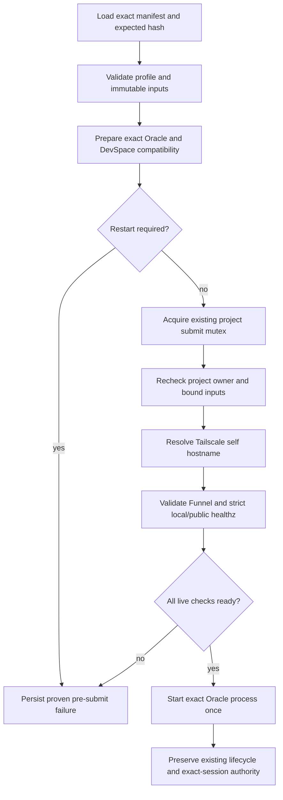

# Oracle Live Readiness Enforcement Record

## Status

- Implemented on public `main`; this file now records the accepted design and
  verification contract rather than pending work.
- Repository: `https://github.com/1Morganmore/DevSpace-Oracle`
- Planning baseline: `002a3dd4656860eb289e117f4392f949311c682a`
- Baseline CI: `release-portability` run `31074487726`, successful.
- Preflight and triage implementation:
  `cce29340fdb23764a9f9112504c6ba5c54ae29aa`.
- Authoritative live submission enforcement:
  `e8bac19946c9a170093c73b663e45a7739147466`.

The implementation is present in `bin/chatgpt_oracle_run.py`. Current operator
behavior is documented in `README.md` and
`skills/chatgpt-oracle-runtime/SKILL.md`. The remaining sections preserve the
design constraints used to review future changes; they are not an instruction
to create another implementation branch.

## Outcome

An Oracle `run` must not open the browser or submit a prompt unless the same
runtime conditions reported by `preflight` are ready at the point of submission.
For DevSpace transport this includes the exact pinned compatibility state, the
running DevSpace listener, Tailscale hostname and Funnel mapping, and strict local
and public DevSpace `/healthz` identity.

The representative operator flow remains:

```text
dispatch --dry-run -> preflight -> run -> Oracle hidden browser -> DevSpace -> output/state readback
```

`preflight` remains read-only, no-submission, and no-run-state. `run` remains the
only submission entry point and records a proven pre-submit failure when a live
readiness condition fails after the run layout has been prepared.

## Resolved problem

Before `e8bac19946c9a170093c73b663e45a7739147466`, `preflight_run()` checked:

- signed-in profile seed;
- unresolved project ownership;
- exact Oracle version and read-only compatibility hashes;
- Tailscale self hostname;
- read-only DevSpace compatibility and exact listener identity;
- Funnel mapping and strict local/public `{ "ok": true, "name": "devspace" }`
  `/healthz` responses.

At that baseline, `execute_run()` did not repeat the volatile DevSpace
hostname, Funnel, and `/healthz` checks immediately before `Popen`. The shipped
implementation now performs the live readiness assessment inside the existing
project submit mutex after final owner and bound-input validation. A failed
check records structured `SUBMISSION_NOT_READY` evidence and exits without
starting Oracle.

Exact-session authority, recovery, settlement, and frozen legacy paths remain
unchanged by this feature.

## Authority and invariants

Preserve these invariants:

1. A preflight result is evidence, not a durable authorization receipt. Runtime
   readiness can change after it is printed.
2. The live check immediately before `Popen` is authoritative for submission.
3. An unresolved exact project owner always blocks a fresh submission.
4. Compatibility preparation may update the pinned package, but a required
   DevSpace restart blocks submission and remains a proven pre-submit failure.
5. A readiness failure must never create a browser process, conversation, or
   replacement workflow.
6. Pro attachment-only transport never depends on DevSpace, Tailscale, or an app.
7. Recovery continues to reuse only the exact stored slug/session and must not
   route through the new-submission readiness flow.
8. Host-only retired state and persisted Oracle recovery semantics remain
   untouched.
9. Do not add a notifier, daemon, cache, persistent readiness receipt, third-party
   dependency, or new public submission command.

## Target control flow



The DevSpace endpoint check belongs inside the existing project submit mutex,
after the final owner/input recheck and immediately before `Popen`. This minimizes
the check-to-submit gap without inventing a second locking mechanism.

## Module design

Keep the implementation in `bin/chatgpt_oracle_run.py` unless the resulting code
cannot remain locally understandable. The external interface stays limited to the
existing `preflight` and `run` commands.

Introduce one internal readiness interface that returns structured check results
and does not submit or mutate run state. An illustrative shape is:

```python
def assess_submission_readiness(
    config,
    *,
    mode: Literal["inspect", "prepare"],
    checks: Collection[str] | None = None,
    adapters: ReadinessAdapters,
) -> dict[str, Any]:
    ...
```

This name and exact Python shape are not mandatory. The required design properties
are:

- one shared result vocabulary for preflight and live failures;
- read-only compatibility adapters for `inspect` mode;
- existing compatibility preparation adapters for `prepare` mode;
- dependency injection remains internal and test-oriented;
- no new public configuration object or pass-through wrapper;
- no repeated Oracle version resolution or compatibility work in one live run.

Prefer extracting only the logic that would otherwise be duplicated. In
particular, the Tailscale hostname, validated DevSpace setup configuration, Funnel
mapping, and strict endpoint identity should be one deep internal module used by
both callers. Existing authoritative project mutex and input validation code must
remain in place rather than being wrapped by a second abstraction.

## Failure semantics

### Explicit `preflight`

- Returns schema `codex.chatgpt.oracle-preflight/v1`.
- Returns `ready` only when every applicable check is ready.
- Returns `not_ready` and the ordered `failed_checks` otherwise.
- Does not create a run directory or browser process.
- Does not apply compatibility patches.
- Does not claim that ChatGPT login or the app UI was checked.

### Live `run`

- Retain `COPY_PROFILE_REQUIRED` before run-layout creation on Windows.
- Compatibility preparation and restart-required handling retain their current
  pre-submit settlement behavior.
- A DevSpace hostname, Funnel, listener, or `/healthz` failure becomes a proven
  `pre_submit_failed` result with `safe_for_fresh_run: true` only after existing
  settlement logic proves that no submission occurred.
- Persist the readiness report or equivalent check evidence in the exact run
  state/transcript so `triage` can explain the failure without parsing incidental
  prose.
- Do not mark a failed readiness check as `attention_required` unless submission
  authority has actually become uncertain.
- Do not call `Popen` when any applicable live check is not ready.

Use a stable top-level error such as `SUBMISSION_NOT_READY` with the failed check
names and structured evidence. Preserve more specific existing errors such as
`COPY_PROFILE_REQUIRED`, `PROJECT_SESSION_STILL_LIVE`, and
`DEVSPACE_SERVICE_RESTART_REQUIRED` where callers already rely on them.

## Implementation sequence

### 1. Lock the readiness contract

- Enumerate the current preflight check names and their ready/error shapes.
- Define which checks apply to DevSpace and which apply to Pro attachment-only.
- Define deterministic check ordering and exit behavior.
- Add contract tests before moving live execution code.

### 2. Extract shared DevSpace readiness logic

- Reuse `detect_tailscale_hostname()`.
- Reuse `DEVSPACE_SETUP.validate_config()` and `DEVSPACE_SETUP.doctor()`.
- Reuse strict `/healthz` validation; do not fall back to generic `/mcp` HTTP
  success.
- Reuse `inspect_devspace_compatibility()` for explicit preflight and
  `ensure_devspace_compatibility()` for live preparation.
- Ensure one invocation of each external check per phase.

### 3. Connect explicit preflight

- Replace the duplicated hostname/config/doctor orchestration with the shared
  internal readiness interface.
- Preserve the current JSON schema and no-state behavior.
- Keep Pro endpoint options forbidden.

### 4. Connect live submission

- Keep compatibility preparation before the project submit mutex.
- If DevSpace was changed and requires restart, stop through the existing proven
  pre-submit path.
- Inside the existing mutex, retain the final owner and bound-input checks.
- Run the shared volatile DevSpace endpoint assessment immediately before
  `Popen`.
- Persist structured evidence and stop without browser creation when not ready.
- Leave the post-`Popen` lifecycle, watchdog, exact-session authority, recovery,
  and settlement code unchanged.

### 5. Update triage evidence consumption

- Prefer the new structured readiness evidence when classifying a live
  pre-submit failure.
- Map it to an existing safe action: fix the named readiness condition, rerun
  explicit preflight, then start one fresh run only when no owner remains.
- Do not add `triage --execute` or automatic recovery.

### 6. Documentation and release surface

- Update `README.md`, `README.en.md`, and
  `skills/chatgpt-oracle-runtime/SKILL.md`.
- State explicitly that preflight is advisory evidence and live readiness is the
  submission authority.
- Add the focused regression nodes to `scripts/run_fast_gate.py`.
- Update release packaging expectations only if an existing shipped file changes;
  do not add a new runtime file without demonstrated need.

## Expected file scope

Primary files:

- `bin/chatgpt_oracle_run.py`
- `tests/test_chatgpt_oracle_run.py`
- `bin/chatgpt_oracle_diagnose.py` only if structured evidence requires a small
  classification change
- `tests/test_chatgpt_oracle_diagnose.py` only with that classification change
- `scripts/run_fast_gate.py`
- `README.md`
- `README.en.md`
- `skills/chatgpt-oracle-runtime/SKILL.md`

Avoid changes to:

- comprehensive workflow ownership and semantic mission generation;
- Web Multi lane topology or capacity;
- Oracle exact-session recovery;
- retired browser runtime code;
- install/update/rollback logic unless release packaging proves it is required.

## Required tests

Add the smallest tests that prove the shared interface and live control flow:

1. Preflight and live assessment produce the same failed check name for the same
   DevSpace endpoint condition.
2. No listener results in no `Popen` and a proven pre-submit failure.
3. HTTP 200 with the wrong JSON identity is rejected.
4. A correct local response with a failing or mismatched Funnel/public response is
   rejected.
5. A compatibility change requiring restart blocks before endpoint checks and
   before `Popen`.
6. A healthy exact listener, Funnel mapping, and local/public identity reach
   `Popen` exactly once.
7. The project owner is rechecked under the existing mutex before the endpoint
   check and submission.
8. Mission, attachment, and bound-input drift still block submission.
9. Pro attachment-only execution never calls DevSpace or Tailscale adapters.
10. Recovery does not call the new-submission readiness interface.
11. Readiness failure evidence is consumed by triage without changing exact owner
    authority.
12. Explicit preflight still creates no run state or browser process.

Tests should cross the same internal readiness interface used by production.
Avoid parallel mock-only helper layers that replace the intended live flow.

## Verification plan

### Focused local verification

Run at minimum:

```powershell
python -m pytest -q `
  tests/test_chatgpt_oracle_run.py `
  tests/test_chatgpt_oracle_diagnose.py `
  tests/test_chatgpt_devspace_compat.py `
  tests/test_devspace_tailscale_setup.py `
  --basetemp "$env:USERPROFILE\t\oracle-live-readiness"

python scripts/run_fast_gate.py --enforce-budget
python scripts/run_golden_path_smoke.py
python scripts/check_portability.py
python scripts/check_skill_metadata.py
git diff --check
```

Use a short Windows `--basetemp`; deep state fixture paths can exceed `MAX_PATH`
under the repository workspace.

### Representative real flow

Verify both directions through the intended CLI:

1. Produce an exact dry-run manifest through `chatgpt_oracle_dispatch.py`.
2. Record the Oracle state run count.
3. Stop or point away from the existing DevSpace listener without changing
   unrelated services.
4. Confirm explicit preflight returns `not_ready` with the exact endpoint check.
5. Invoke live `run` with the exact manifest and hash and prove no Oracle browser
   process or conversation was created; read back the proven pre-submit state.
6. Restore/start the existing pinned DevSpace service and Funnel.
7. Confirm strict local and public `/healthz` identity and preflight `ready`.
8. Run one harmless representative Oracle+DevSpace mission through the actual
   hidden-browser entry point.
9. Read back the exact terminal state, nonempty output, task outcome, conversation
   identity, and unchanged project authority semantics.

Do not substitute a fake HTTP server or a lower-level function call for the two
real CLI flows. Tests may support the verification but do not replace it.

## Completion gates

Implementation is complete only when all are true:

- unhealthy DevSpace cannot reach Oracle `Popen` or ChatGPT submission;
- healthy DevSpace reaches the existing primary Oracle flow exactly once;
- explicit preflight remains read-only and no-state;
- live readiness failure has authoritative structured evidence and correct
  pre-submit settlement;
- Pro and recovery paths retain their accepted semantics;
- focused tests, fast gate, golden path, portability, and skill metadata pass;
- v4 focused/full and the v3 contract gate pass as configured by the repository
  workflow;
- the change is committed descriptively on the implementation branch;
- the public-safe commits are pushed to public `main` only after verifying there
  is no private history or host-specific data;
- GitHub `release-portability` succeeds for the exact pushed SHA;
- the final worktree is clean and `origin/main` authoritative readback matches the
  reported SHA.

## Explicitly deferred

- A unified project `status` command combining preflight and triage.
- Automatic execution of triage recovery actions.
- Persistent or signed readiness receipts.
- DevSpace auto-start/restart from `run`.
- CI contract-suite deduplication and performance work.
- New desktop notifications; Oracle remains the normal completion notifier.

These are separate improvements and must not be absorbed into this implementation.
